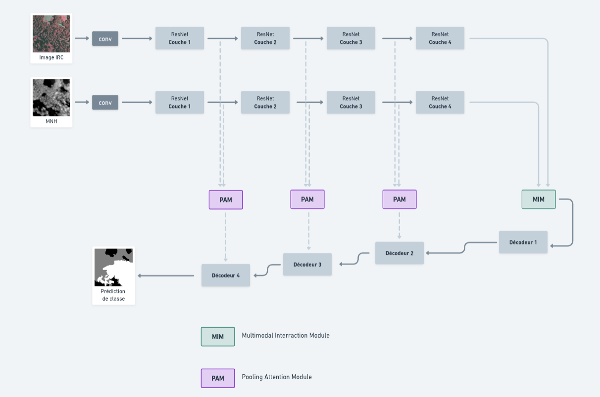
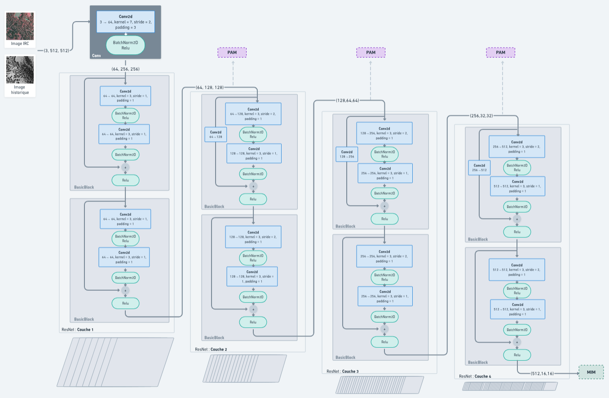
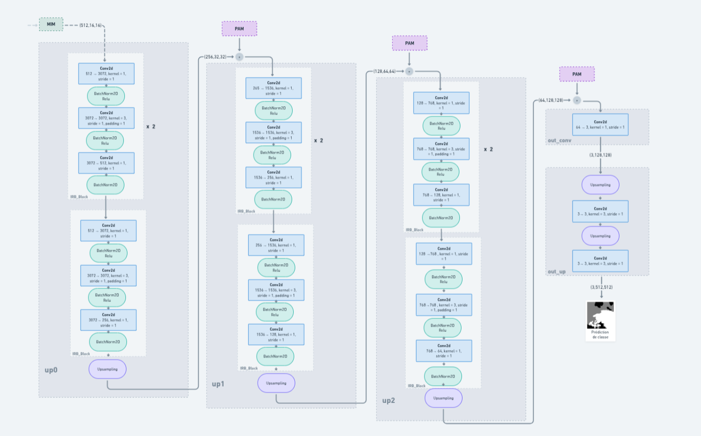
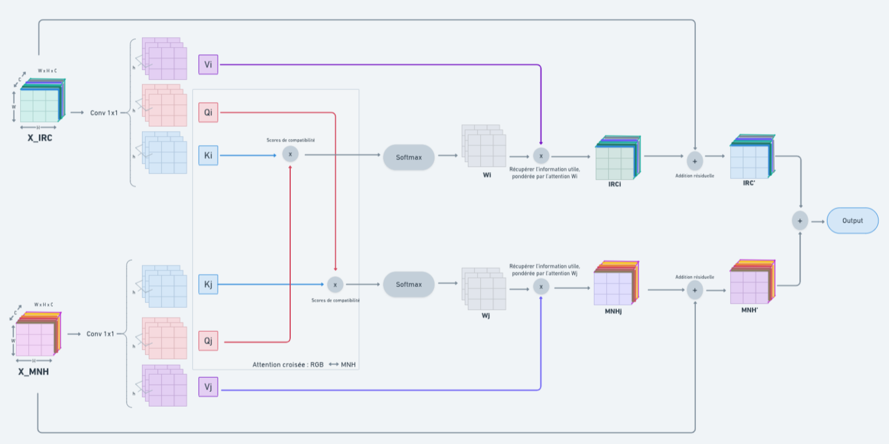
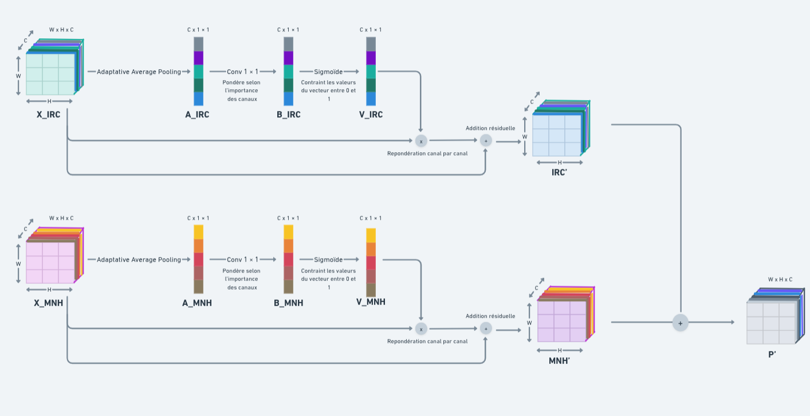

# Détection de la maturité écologique des forêts d’Occitanie

Ce dépôt contient un modèle de segmentation sémantique appliqué à l’estimation du degré de maturité écologique des forêts en région Occitanie.

Le modèle repose sur l’architecture [MIPANet](https://github.com/2295104718/MIPANet), une approche de segmentation RGB-D multimodale basée sur des mécanismes d’interaction croisée et d’attention. Elle permet d'exploiter efficacement la complémentarité entre les sources de données pour améliorer la précision de la segmentation.

Ce travail s’inscrit dans le cadre de mon stage de fin d’études de M2, dont l’objectif est de **cartographier à large échelle la maturité écologique des forêts par télédétection multimodale**.

Le modèle est actuellement adapté pour traiter plusieurs types de modalitées :
- **Image IRC** (infrarouge – rouge – vert)
- **Carte MNH** (Modèle Numérique de Hauteur de canopée)
- **Carte de biomasse** 
- **Images historiques** 

  ## Structure du modèle (exemple pour 2 branches)
  ### Structure globale

  Voici un aperçu schématique de l’architecture globale du MIPANet:  

    

### Encodeur
L’encodeur est un **ResNet18**. 

 

### Décodeur
 
Le décodeur repose sur des blocs IRB inspirés de MobileNetV2, combinant convolutions point-wise et depth-wise pour effectuer l’upsampling tout en capturant les structures spatiales fines.
Le papier MobileNetV2 appelle la convolution utilisé “convolutions séparables en profondeur (Depthwise Separable Convolutions)”.

### Pooling Attention Module  
Le Pooling Attention Module (PAM) pondère les canaux des cartes de caractéristiques en fonction de leur importance, pour compenser la perte d'information lors de l'upsampling.  

  

### Multi-modal Interaction Module
Le Multi-modal Interaction Module (MIM) applique un mécanisme d’attention croisée entre les features IRC et MNH, permettant à chaque modalité d’enrichir ses représentations à partir de l’autre.  

